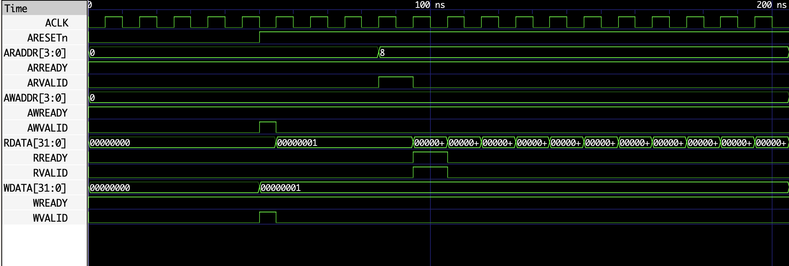
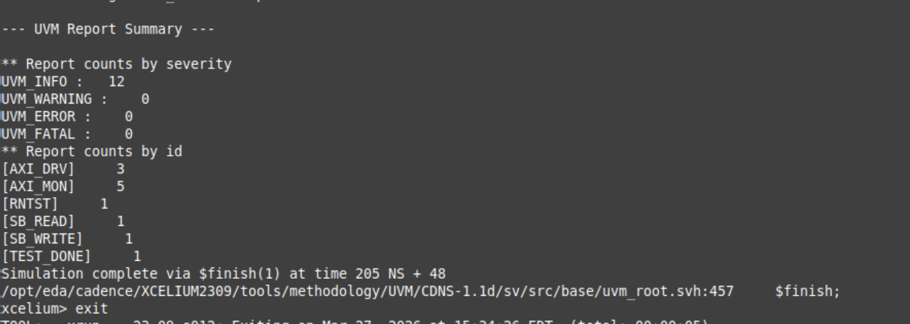

# AXI4-Lite Timer — RTL Design + UVM Verification

A fully synthesizable **AXI4-Lite Timer Peripheral** with a complete **UVM verification environment**, built to demonstrate end-to-end design and verification proficiency at the level expected in production ASIC development.

---

## Simulation Results

### AXI4-Lite Protocol Waveform


Write to CTRL (start timer) followed by a read from COUNT, captured in Xcelium. All five AXI4-Lite channels visible — address, data, and response handshaking working correctly with no protocol violations.

### UVM Test Summary — Zero Errors


`test_basic` completes cleanly: **12 UVM_INFO, 0 UVM_WARNING, 0 UVM_ERROR, 0 UVM_FATAL**. Scoreboard validated the COUNT register read against the reference model and confirmed non-zero count with timer enabled.

---

## Architecture Overview

```
┌─────────────────────────────────────────────────────────────┐
│                        top_timer.sv                         │
│                                                             │
│   AXI4-Lite Slave Interface (axi4lite_if.sv)               │
│   ┌─────────────────┐     ┌───────────────────────────┐    │
│   │  timer_regs.sv  │────▶│      timer_core.sv        │    │
│   │                 │     │                           │    │
│   │  0x0  CTRL      │     │  32-bit up-counter        │    │
│   │  0x4  LOAD      │     │  Start/Stop FSM           │    │
│   │  0x8  COUNT     │◀────│  Overflow + IRQ gen       │    │
│   │  0xC  IRQSTAT   │     │  Reload on overflow       │    │
│   └─────────────────┘     └───────────────────────────┘    │
└─────────────────────────────────────────────────────────────┘
```

---

## RTL Design

### Module Hierarchy

| Module | File | Description |
|---|---|---|
| `top_timer` | [rtl/top_timer.sv](rtl/top_timer.sv) | AXI4-Lite slave integration, channel handshaking |
| `axi4lite_if` | [rtl/axi4lite_if.sv](rtl/axi4lite_if.sv) | Parameterized interface (AW=4, DW=32) |
| `timer_regs` | [rtl/timer_regs.sv](rtl/timer_regs.sv) | Address decode, register read/write logic |
| `timer_core` | [rtl/timer_core.sv](rtl/timer_core.sv) | Counter FSM, overflow detection, IRQ |

### Register Map

| Address | Register | Access | Description |
|---|---|---|---|
| `0x0` | CTRL | R/W | bit[0] = start, bit[1] = stop |
| `0x4` | LOAD | R/W | 32-bit reload value on overflow |
| `0x8` | COUNT | RO | Current counter value (live) |
| `0xC` | IRQSTAT | R/W1C | Interrupt status, write-1-to-clear |

### Design Highlights
- AXI4-Lite AWREADY/WREADY tied high for single-cycle write acceptance
- BVALID registered — asserted on AWVALID & WVALID, cleared on BREADY
- ARREADY tied high; read_pending flag drives RVALID state machine
- Timer IRQ auto-reloads COUNT from LOAD register on overflow
- Fully synthesizable — no latches, no initial blocks in RTL

---

## UVM Verification Environment

```
test_basic
└── timer_env
    ├── axi_agent (active)
    │   ├── axi_sequencer
    │   ├── axi_driver       ──▶  DUT (via VIF)
    │   └── axi_monitor      ──▶  analysis_port
    │                                  │
    ├── timer_scoreboard  ◀────────────┤
    └── timer_cov         ◀────────────┘
```

### Components

| Component | File | Role |
|---|---|---|
| `top_tb` | [tb/top_tb.sv](tb/top_tb.sv) | Clock/reset gen, VIF config_db, test launch |
| `tb_pkg` | [tb/tb_pkg.sv](tb/tb_pkg.sv) | Package with all TB includes |
| `test_basic` | [tb/tests/test_basic.sv](tb/tests/test_basic.sv) | Directed test, objection management |
| `basic_read_write_seq` | [tb/sequences/basic_read_write_seq.sv](tb/sequences/basic_read_write_seq.sv) | Write CTRL start → Read COUNT |
| `timer_env` | [tb/env/timer_env.sv](tb/env/timer_env.sv) | Environment, build/connect phase |
| `timer_scoreboard` | [tb/env/timer_scoreboard.sv](tb/env/timer_scoreboard.sv) | Reference model, protocol check |
| `timer_cov` | [tb/env/timer_cov.sv](tb/env/timer_cov.sv) | Functional coverage groups |
| `axi_agent` | [tb/env/axi_agent/axi_agent.sv](tb/env/axi_agent/axi_agent.sv) | Agent instantiation and connections |
| `axi_driver` | [tb/env/axi_agent/axi_driver.sv](tb/env/axi_agent/axi_driver.sv) | AXI4-Lite channel handshaking |
| `axi_monitor` | [tb/env/axi_agent/axi_monitor.sv](tb/env/axi_agent/axi_monitor.sv) | Transaction capture on all channels |
| `axi_seq_item` | [tb/env/axi_agent/axi_seq_item.sv](tb/env/axi_agent/axi_seq_item.sv) | Randomizable transaction class |

### Scoreboard — Reference Model

The scoreboard maintains a software reference model of all writable registers (`CTRL`, `LOAD`, `IRQSTAT`) and performs per-read comparison:

- **CTRL / LOAD / IRQSTAT**: exact value match against reference model; flags `READ MISMATCH` on failure
- **COUNT (0x8)**: context-aware check — expects non-zero when `CTRL[0]=1` (timer running), expects zero when disabled

### Functional Coverage

**`cg_reg_access`** — register-level access coverage
- `cp_is_write`: read vs. write operations
- `cp_addr`: bins for CTRL (0x0), LOAD (0x4), COUNT (0x8), IRQSTAT (0xC)
- `cross_is_addr`: cross of operation type × register address

**`cg_ctrl_bits`** — control register state coverage
- `cp_start`: CTRL[0] toggled
- `cp_stop`: CTRL[1] toggled
- `cross_start_stop`: cross of start and stop bits

**`cg_irq`** — interrupt handling coverage
- `cp_clear`: IRQ clear writes (write-1-to-clear)
- `cp_evt`: non-zero IRQSTAT writes
- `cross_irq`: cross of clear operations × event writes

---

## Test Execution

### Run Simulation (Cadence Xcelium)

```bash
cd sim
xrun -f xrun.f \
  -incdir ../tb ../tb/env ../tb/env/axi_agent ../tb/sequences ../tb/tests \
  ../rtl/*.sv ../tb/*.sv \
  -uvm -top top_tb \
  +UVM_TESTNAME=test_basic \
  +UVM_VERBOSITY=UVM_MEDIUM \
  -access +rwc
```

### What the Test Exercises

| Time (ns) | Event |
|---|---|
| 0–50 | Reset deassertion (`ARESETn` held low) |
| ~55 | Driver writes `CTRL=0x1` (start) to address `0x0` |
| ~75 | Write completes; scoreboard updates reference model `CTRL ← 0x1` |
| ~85 | Driver reads `COUNT` from address `0x8` |
| ~105 | Monitor captures `RDATA=0x3`; scoreboard confirms non-zero count |
| 205 | Test drops objection, simulation exits |

---

## Skills Demonstrated

| Area | Details |
|---|---|
| **AXI4-Lite Protocol** | All 5 channels implemented and verified — AW, W, B, AR, R |
| **RTL Design** | Synthesizable SystemVerilog, FSM, interrupt logic, register bank |
| **UVM Architecture** | Agent, env, test, sequence, scoreboard, coverage — full stack |
| **Transaction-Level Modeling** | Randomizable `axi_seq_item`, sequence-based stimulus |
| **Reference Modeling** | Software model in scoreboard for read-back verification |
| **Functional Coverage** | Covergroups with bins, cross coverage across register and control space |
| **VIF Configuration** | `uvm_config_db` set/get pattern for virtual interface passing |
| **Analysis Port Pattern** | Monitor → scoreboard + coverage broadcast via `uvm_analysis_port` |
| **Waveform Debug** | VCD dump + Xcelium waveform viewer, signal-level protocol debug |
| **Clean Simulation** | 0 errors, 0 warnings on Cadence Xcelium |

---

## Project Structure

```
axi4lite_timer/
├── rtl/
│   ├── axi4lite_if.sv
│   ├── top_timer.sv
│   ├── timer_regs.sv
│   └── timer_core.sv
├── tb/
│   ├── top_tb.sv
│   ├── tb_pkg.sv
│   ├── tests/
│   │   └── test_basic.sv
│   ├── sequences/
│   │   └── basic_read_write_seq.sv
│   └── env/
│       ├── timer_env.sv
│       ├── timer_scoreboard.sv
│       ├── timer_cov.sv
│       └── axi_agent/
│           ├── axi_agent.sv
│           ├── axi_sequencer.sv
│           ├── axi_driver.sv
│           ├── axi_monitor.sv
│           └── axi_seq_item.sv
├── sim/
│   ├── xrun.f
│   ├── xrun.log
│   └── waves.vcd
└── screenshots/
    ├── waveform.png
    └── UVM_Summary_Report.png
```
